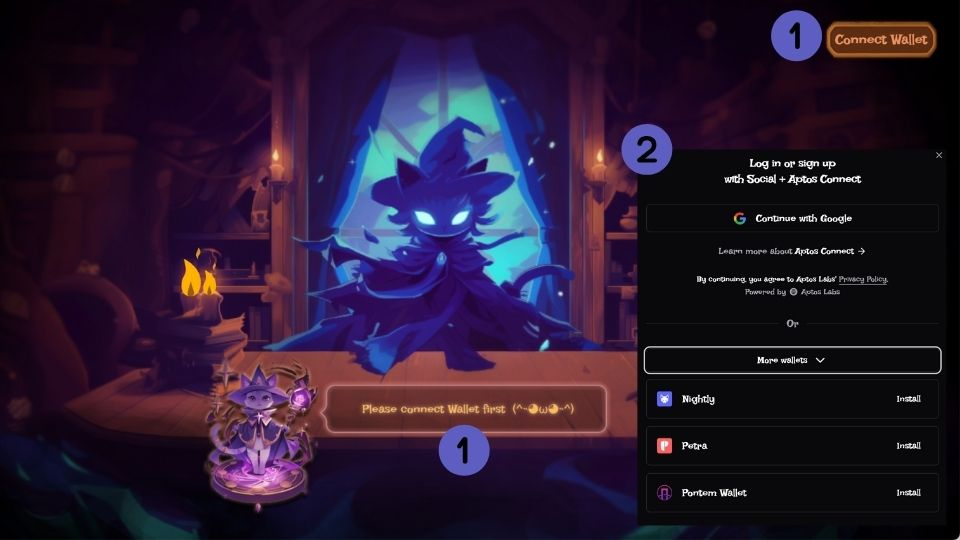
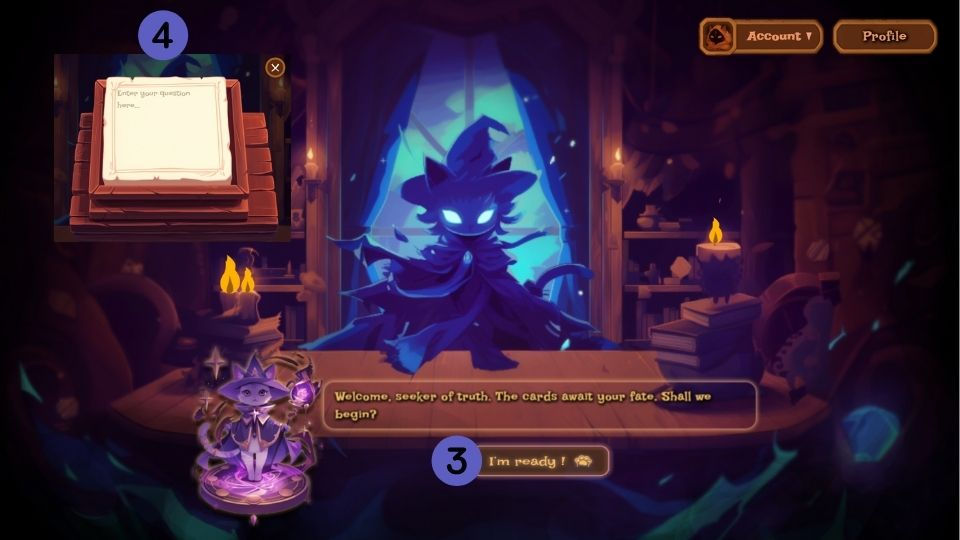
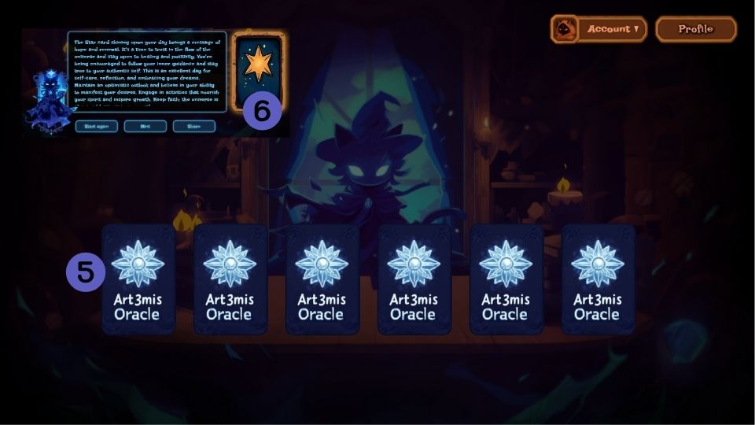
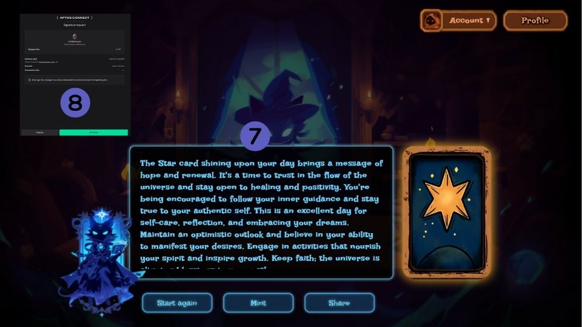

# **Artemis Oracle User Flow Documentation**  

Welcome to **Artemis Oracle**, your one-stop **AI on-chain tarot** platform. This guide will walk you through connecting your wallet, asking questions, drawing tarot cards on-chain, and saving your readings as NFTs for future reference.  

---

## **Table of Contents**  
- [Overview](#overview)  
- [User Flow Steps](#user-flow-steps)  
  - [Connecting Your Wallet](#step-1-connecting-your-wallet)  
  - [Asking Your Question](#step-2-asking-your-question)  
  - [Drawing a Tarot Card](#step-3-drawing-a-tarot-card)  
  - [Saving Your Reading](#step-4-saving-your-reading-as-an-nft)  

---

## **Overview**  
**Artemis Oracle** combines the mystical art of tarot with the power of AI and blockchain technology. Through a smooth user experience, the platform enables you to:  

- Connect your wallet to access on-chain features.  
- Ask personalized questions for tarot readings.  
- Draw cards shuffled by smart contracts.  
- Save your tarot reading as an NFT for future reference.  

### **Key Features**:  
- **On-chain Tarot Reading:** Fully transparent and randomized card draws powered by blockchain.  
- **AI Interpretation:** Dedicated readings based on your question and selected card.  
- **NFT Integration:** Save readings as NFTs for easy retrieval and storage.  

---

## **User Flow Steps**  

### **Connecting Your Wallet**  
Begin by navigating to [**https://www.art3mis.xyz**](https://www.art3mis.xyz).  

1. Click **"Connect Wallet"** on the homepage. 
2. Login with Google or choose a compatible wallet as Nightly, Petra or Pontem Wallet.
   Follow the prompts to securely connect your wallet.

---

### **Asking Your Question**  
3. After connecting your wallet, click on **"I'm ready!"** you will be prompted to enter a question for your tarot reading.  
4. Type your question in the input field and confirm.
   

---

### **Drawing a Tarot Card**  
5. The platform will shuffle tarot cards using a **smart contract** for true randomness. Click on one of the cards to reveal your fate.  
6. The platform will display your selected card along with an AI-powered interpretation based on your question.  

---

### **Saving Your Reading as an NFT**  
7. After the reading, you'll have the option to:
  -**Start again** If you'd like to ask another question and receive a new reading.
  -**Mint** the reading as an NFT.
  -**Share** your reading and the insights with your followers on Twitter.
8. If you click on **Mint** confirm the transaction in your connected wallet to save the reading on-chain.  

---

## **Final Notes**  
This guide outlines the main steps and features of **Artemis Oracle**, making it easy for you to access on-chain tarot readings and mint them as NFTs. Stay tuned for updates and new features!  

---
